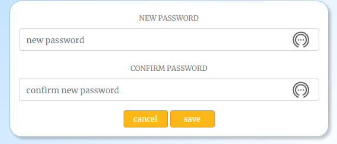

<h1 align="center">"Travel Shutter" React App</h1>

<h3 align="center">HTML5 CSS3, Bootstrap, JavaScript, Cloudinary, Heroku</h3>

<br>

**Developer:** Aleksander Kisielewicz

**[View live website here](https://travel-shutter.herokuapp.com/)** :computer:


Travel Shutter Website was created as Portfolio Project #5 (Advanced front-end/React) for Diploma in Full Stack Software Development at [Code Institute](https://www.codeinstitute.net). The back-end for this application is provided by the DRF TravelShutter API, which is a part of this project and can be found in separate repository, links below:

- Back-end repository: [https://github.com/alexkisielewicz/drf-travelshutter](https://github.com/alexkisielewicz/drf-travelshutter)
- Back-end deployment: [https://drf-travelshutter.herokuapp.com/](https://drf-travelshutter.herokuapp.com/)

Project purpose:

"In this project, you will design and build a content-sharing web application with React and an API (Django Rest Framework) Back-End. This will allow your users to browse and comment/ like each other's content as well as add, edit and delete their own. The users will also be able to follow one another.

The data is presented in a way that makes it easy for users to find what they're looking for."

Application offers such functionalities as:

- **User registration** - Users can register in the app filling in the form with username and password
- **Sign in/out** - Users can conveniently sign in and out of their account
- **User Profile** - Users can change profile details, username and the password and view own posts in the profile
- **Post management** - Users can add, update, and delete their posts with ease (CRUD)
- **Commenting** - Users can leave comments on posts, update or delete them
- **Liking** - Users can add likes to posts to show their appreciation
- **Filtering content** - Users can apply filters to display categorized posts
- **Search optio** - Users can search posts by title, author, category  
- **Messages/feedback** - Users receive feedback and confirmation to their actions in the app.

# Table of content

- [Project](#project)
  - [Strategy/Scope](#strategyscope)
  - [Agile Methodology for project planning](#agile-methodology-for-project-planning)
  - [User stories](#user-stories)
  - [Wireframes](#wireframes)
- [User Experience (UX/UI)](#user-experience-ux)
  - [Colour Scheme](#colour-scheme)
  - [Typography](#typography)
- [Logic and features](#logic-and-features)
  - [Database model and database structure](#data-model-ad-database-structure)
  - [Features](#features)
    - [Navbar and menu](#navbar-and-main-menu)
    - [Home page](#home-page)
    - [Full Post View](#full-post)
    - [Add/edit post](#addedit-post---form-validation)
    - [Feedback Messages](#feedback-messages)
- [Technology](#technology)
  - [Software used](#software-used)
  - [Python libraries/modules](#python-librariesmodules)
- [Testing](#testing)
  - [Manual testing](#manual-testing)
  - [Bugs/known issues](#bugsknown-issues)
- [Deployment](#deployment)
  - [Database](#database-elephangsql)
  - [Cloudinary](#cloudinary)
  - [Django secret key](#django-secret-key)
  - [Github and Gitpod](#github-and-gitpod)
  - [Heroku](#heroku)
- [Possible future development](#possible-future-development)
- [Credits](#credits)
  - [Code](#code)
  - [Media](#media)
  - [Acknowledgements](#acknowledgements)

# Project

## Strategy/Scope

I opted to develop a web application with real-life usability. My primary objective was always to deliver an exceptional user experience. Hence, I decided to create a web app that is both practical and visually appealing. "Travel Shutter" is a user-friendly website where users can share their travel moments through captivating posts comprising images and text.

The application aims to provide a sleek and intuitive user interface, ensuring easy accessibility and seamless navigation across all features. Moreover, it is designed to be responsive, adapting to various screen sizes and devices.

The website caters to a diverse audience passionate about travel, photography, and sharing their stories through captivating visuals.

To achieve the strategy goals I implemented following features:

- a clean and intuitive user interface for ease of navigation and readability,
- a menu that provides easy access to all website sections, including personalized content for logged in users,
- cloud hosting of images for optimized website speed and user experience,
- feedback messages to users for all important actions taken on the website.

## Agile Methodology for project planning

During the development of my website, I used the agile methodology. With a focus on delivering essential functionalities, I employed a prioritization system categorizing features as "must-have" or "could-have." This allowed me to allocate resources effectively and plan for future developments.

To guide my development process, I created user stories and added them to the kanban board divided into following sections: "to do", "in progress" "done", "future enhancements" and "bugs" that allowed to visualize all tasks and prioritize next steps.
I utilized milestones to group basic functionalities into groups and keep track of them completion.
By using agile methodology, I was able to stay organized and focused on delivering the most important features, while also allowing flexibility for future development. This experience gave me valuable insight and lessons that I can apply to future projects.

[Project @GitHub](https://github.com/users/alexkisielewicz/projects/4)


### User stories

| Milestone  | User story |
|------------|------------|
| Navigation | [#1](https://github.com/alexkisielewicz/travel-shutter/issues/1) As a user, I can view a navbar from every page, so that I can easily navigate between pages. |
| Navigation | [#7](https://github.com/alexkisielewicz/travel-shutter/issues/7) As a logged-out user, I can see sign-in and sign-up options, so that I can sign in or sign up. As a logged-in user, I can see the sign-out link. |
| Navigation | [#2](https://github.com/alexkisielewicz/travel-shutter/issues/2) As a user, I can navigate through pages quickly without page refresh, so that I can seamlessly view content. |
| Authentication | [#3](https://github.com/alexkisielewicz/travel-shutter/issues/3) As a user, I can create a new account, so that I can access all the features for signed-up users. |
| Authentication | [#4](https://github.com/alexkisielewicz/travel-shutter/issues/4) As a user, I can sign in to the app, so that I can access functionality for logged-in users.  |
| Authentication | [#5](https://github.com/alexkisielewicz/travel-shutter/issues/5) As a user, I can see if I am logged in or not, so that I can log in if I need. |
| Authentication | [#6](https://github.com/alexkisielewicz/travel-shutter/issues/6) As a user, I can maintain a logged-in status until I decide to log out so that my user experience is not compromised. |
| User interface | [#8](https://github.com/alexkisielewicz/travel-shutter/issues/8) As a user, I can view profile avatars, so that I can easily identify users of the application. |
| Posts | [#9](https://github.com/alexkisielewicz/travel-shutter/issues/9) As a logged-in user, I can create posts, so that I can share my images in the app. |
| Posts | [#10](https://github.com/alexkisielewicz/travel-shutter/issues/10) As a user, I can view the details of a single post, so that I can learn more about it. |
| Posts | [#11](https://github.com/alexkisielewicz/travel-shutter/issues/11) As a logged-in user, I can like a post, so that I can show my support for the posts that interest me. |
| Posts | [#12](https://github.com/alexkisielewicz/travel-shutter/issues/12) As a user, I can view all the most recent posts, ordered by the most recently created first, so that I am up to date with the newest content. |
| Posts | [#13](https://github.com/alexkisielewicz/travel-shutter/issues/13) As a user, I can search for posts with keywords, so that I can find the posts by title, username, or category they have been posted in. |
| Posts | [#14](https://github.com/alexkisielewicz/travel-shutter/issues/14) As a user, I can select a category from the menu, so that I can find all the posts from the category that I am interested in. |
| Posts | [#15](https://github.com/alexkisielewicz/travel-shutter/issues/15) As a logged-in user, I can view the posts I liked, so that I can find the posts I interacted with by adding a like. |
| Posts | [#17](https://github.com/alexkisielewicz/travel-shutter/issues/17) As a user, I can keep scrolling through the posts on the website, which are loaded automatically, so I don't have to use pagination. |
| Posts | [#19](https://github.com/alexkisielewicz/travel-shutter/issues/19) As the post owner, I can edit post details and image, so that I can make corrections or update my post after it was created. |
| Following users | [#16](https://github.com/alexkisielewicz/travel-shutter/issues/16) As a logged-in user, I can view content filtered by the users I follow, so that I can keep up to date with what they are posting about. |
| Comments | [#18](https://github.com/alexkisielewicz/travel-shutter/issues/18) As a user, I can view the comments about a post, so that I can read what other users think about it. |
| Comments | [#20](https://github.com/alexkisielewicz/travel-shutter/issues/20) As a logged-in user, I can add comments to a post, so that I can share my thoughts about it. |
| Comments | [#21](https://github.com/alexkisielewicz/travel-shutter/issues/21) As a user, I can see how long ago a comment was made, so that I know how old a comment is. |
| Comments | [#22](https://github.com/alexkisielewicz/travel-shutter/issues/22) As the owner of a comment, I can delete my comment, so that I can control the removal of my comment from the application. |
| Comments | [#23](https://github.com/alexkisielewicz/travel-shutter/issues/23) As the owner of a comment, I can edit my comment, so that I can update it or correct entered text. |
| Profiles | [#24](https://github.com/alexkisielewicz/travel-shutter/issues/24) As a user, I can view other user's profiles, so that I can see their posts and learn more about them. |
| Profiles | [#25](https://github.com/alexkisielewicz/travel-shutter/issues/25) As a user, I can see a list of the most followed profiles, so that I can discover popular profiles. |
| Profiles | [#27](https://github.com/alexkisielewicz/travel-shutter/issues/26) As a user, I can view statistics about a specific user, including their bio, number of posts, follows, and users followed, so that I can learn more about them. |
| Profiles | [#27](https://github.com/alexkisielewicz/travel-shutter/issues/27) As a logged-in user, I can follow and unfollow other users, so that I can see and remove posts by specific users in my posts feed. |
| Profiles | [#28](https://github.com/alexkisielewicz/travel-shutter/issues/28) As a user, I can view all the posts by a specific user, so that I can catch up on their latest posts or decide to follow them. |
| Profiles | [#29](https://github.com/alexkisielewicz/travel-shutter/issues/29) As a logged-in user, I can edit my profile, so that I can change my profile picture and other details. |
| Profiles | [#30](https://github.com/alexkisielewicz/travel-shutter/issues/30) As a logged-in user, I can change my username and password, so that I can change my display name and keep my profile secure. |
| Improvements | [#31](https://github.com/alexkisielewicz/travel-shutter/issues/31) As a user, I want to see a deletion confirmation message when attempting to delete an item that I created, so that I can ensure that I intend to delete the item before proceeding.
| Improvements | [#32](https://github.com/alexkisielewicz/travel-shutter/issues/32) As a user, I want to receive feedback as a response to my actions, so that I can have a clear understanding of the outcome of my actions and stay informed. |
| Improvements | [#33](https://github.com/alexkisielewicz/travel-shutter/issues/33) As a user, I want to be able to click on a post category, so that I can view all posts belonging to that category on the posts page with the category filter applied. |
| Improvements | [#34](https://github.com/alexkisielewicz/travel-shutter/issues/34) As a user, I want to see the top 5 posts with the most likes, so that I can quickly access popular and engaging content. |
| Improvements | [#35](https://github.com/alexkisielewicz/travel-shutter/issues/35) As a user, I can add tags to the posts and view the list of the posts associated with specific tags, so I can browse posts that I am interested in. |
## Wireframes

[Wireframes - PDF File](docs/************.pdf)


# User Experience (UX)

## Colour Scheme

Colour palette was selected using coolors.co generator from among trending colour sets.


- #8ECAE6 - soft blue
- #219EBC - strong cyan
- #023047 - dark navy
- #FFB703 - vivid orange
- #FB8500 - pure orange

## Typography

The [Merriweather](https://fonts.google.com/specimen/Merriweather) font is the main font used throughout the whole website with Sans Serif as the fallback. Merriweather is a clean, modern looking and well known font. It is sourced from Google fonts and it's linked to css document via @import method.


The [Playfair Display S](https://fonts.google.com/specimen/Playfair+Display+SC?query=Playfair+Display+S) font was chosen for posts headings. It is a serif typeface known for its elegant and sophisticated appearance. The "S" in Playfair Display S stands for "Small Caps," indicating that it includes small capital letters as an alternative to the regular uppercase letters. This font is often favored for projects that require a classic and timeless look, such as editorial designs, branding, and luxury products.


Example header and paragraph:


# Logic and features

## Data model ad database structure

Project uses cloud-based PostgreSQL database provided by [ElephantSQL](https://www.elephantsql.com/) as a service. More information can be found in back-end application repository [here](https://github.com/alexkisielewicz/drf-travelshutter#data-model-ad-database-structure)

## Features

### Navbar and main menu

 


### Home page


### Sign up / sign in
[label](README.md)  
### Search bar and categories


### Full Post


  

### Profiles to follow


### Add/Edit Post


### Side Menu

### Categories panel

### Trending Posts

### Profile

 
 
 
 
 
 


### Feedback Messages

### Not found - 404 page


# Technology

## Languages used

- [HTML5](https://en.wikipedia.org/wiki/HTML5) - markup language used for structuring webpage content
- [CSS3](https://en.wikipedia.org/wiki/CSS) - stylesheet language
- [JavaScript](https://en.wikipedia.org/wiki/JavaScript) - high-level, imperative, programming language.
- [Markdown](https://en.wikipedia.org/wiki/Markdown) - markup language used to write README and TESTING documents.

## Software / frameworks / libraries

- [Axios](https://www.npmjs.com/package/axios) - promise based HTTP client for the bowser and node.js
- [Balsamiq](https://balsamiq.com/) - used to create project wireframes
- [Bootstrap 4.6.0](https://react-bootstrap-v4.netlify.app/) - CSS framework developed by Twitter
- [Canva](https://www.canva.com/) - used to design logo picture
- [Coolors.co](https://coolors.co/) - was used to create colour palette for terminal display page
- [Favicon.io](https://www.favicon.io) - tool used to create favicon
- [Font Awesome:](https://fontawesome.com/) - Font Awesome icons were used for social links in terminal display page
- [Git](https://git-scm.com/) - Git was used for version control by utilizing the Gitpod terminal to commit to Git and Push to GitHub
- [GitHub](https://github.com/) - GitHub is used to store the project's code after being pushed from Git
- [Google DevTools](https://developer.chrome.com/docs/devtools/) - used for developing HTML/CSS/DOM navigating/JavaScript console
- [Google Lighthouse](https://developer.chrome.com/docs/lighthouse/overview/) - used for testing website performance
- [Heroku](https://heroku.com) - online app used to deploy project
- [jwt-decode](https://www.npmjs.com/package/jwt-decode) - library that helps decoding JWTs token which are Base64Url encoded
- [Pexels](https://www.pexels.com/) - was used to source bacground picture for terminal display page
- [React-infinite-scroll-component](https://www.npmjs.com/package/react-infinite-scroll-component) infinite scroll for posts and comments
- [React router](https://reactrouter.com/en/main) - enables "client side routing".
- [React toastify](https://www.npmjs.com/package/react-toastify) - toasts for feedback messages
- [React JS 17.02](https://legacy.reactjs.org/docs/getting-started.html)
- [Techsini.com](https://techsini.com/multi-mockup/) - website mockup generator
- [WAVE](https://wave.webaim.org/) - web accessibility online tool
- [WebAIM](https://webaim.org/resources/contrastchecker/) - online tool to check colour contrast/accesibility

# Testing

## Manual testing

Details of manual testing can be found in [TESTING.md](TESTING.md) file.

## Bugs/known issues

Minor syntax and spelling errors were eliminated during development in , below is a list of registered issues.

| Issue | Problem | Solution |
|-------|---------|----------|


# Deployment

App was deployed to heroku for the first time when React installation was completed to make sure that everything is working correctly at early stage of development.


## GitHub and Gitpod

Note: Repository was created using Code Institute template: [https://github.com/Code-Institute-Org/gitpod-full-template](https://github.com/Code-Institute-Org/gitpod-full-template)

1. Login to Github and navigate to repository: [https://github.com/alexkisielewicz/photo-adventures](https://github.com/alexkisielewicz/photo-adventures)

2. Click on "Fork button" in upper-right corner and create a new form in your own account.

3. Open your repository in local IDE or using Gitpod. Preferred way is to used [Chrome Gitpod Extension](https://chrome.google.com/webstore/detail/gitpod-always-ready-to-co/dodmmooeoklaejobgleioelladacbeki). When you install extension, green "Gitpod" button appears in your repository. Click on it to cread new workspace.

4. Go to workspace terminal and install all requirements using command: "pip install -r requirements.txt". All te packages will be installed. requirements.txt content:

    ```python
    asgiref==3.6.0
    cloudinary==1.32.0
    crispy-bootstrap5==0.7
    dj-database-url==0.5.0
    dj3-cloudinary-storage==0.0.6
    Django==3.2.18
    django-allauth==0.52.0
    django-crispy-forms==2.0
    django-social-share==2.3.0
    django-summernote==0.8.20.0
    django-taggit==3.1.0
    gunicorn==20.1.0
    oauthlib==3.2.2
    psycopg2==2.9.5
    PyJWT==2.6.0
    python3-openid==3.2.0
    pytz==2022.7.1
    requests-oauthlib==1.3.1
    sqlparse==0.4.3
    ```

5. Local env.py file should be configured as on example below:

    ```python
    import os

    # Env vars
    os.environ["DATABASE_URL"] = "postgres://yourLinkCopiedFromElephantSQLDashboard"
    os.environ["SECRET_KEY"] = "YourSecretKey"
    os.environ["CLOUDINARY_URL"] = "cloudinary://yourLinkCopiedFromCloudinaryDashboard"

    # Gmail vars
    os.environ["EMAIL_HOST_USER"] = "youremail@gmail.com"
    os.environ["EMAIL_HOST_PASSWORD"] = "passwordObtainedFromGoogleAccount"
    os.environ["DEFAULT_FROM_EMAIL"] = "Photo Adventures"
    ```

6. In order to save django changes in database migration needs to be made.

7. Use terminal commands:

    ```text
    python3 manage.py makemigrations
    python3 manage.py migrate
    ```

8. Create superuser to access admin area using terminal command (email is optional, password won't be visible when typing, confirm password twice):

    ```text
    python3 manage.py createsuperuser
    ```

9. App can be run in gitpod enviroment using terminal command:

    ```text
    python3 manage.py runserver
    ```

10. Go to Heroku and follow further instructions below.

## Heroku

1. Navigate to [https://heroku.com/](https://heroku.com/) login to your account and open dashboard. Click button "New" and select "Create new app" button.

2. Enter app name, I used "photo-adventures", chose your region and click on "Create app" button.

3. Click on newly created app and go to "Deploy" tab and then to "Deployment method" section. Authorize and connect your GitHub account, then find and select your repository.

4. Go to the "Settings" tab, click on "Reveal Config Vars" and add the following keys and values (all values should be strings without any quotation marks):

    NOTE: DISABLE_COLLECTSTATIC variable should be set to "1" for initial deployment. Before final deployment it should be removed.

    | Key                    | Value                                                            |
    |------------------------|------------------------------------------------------------------|
    | CLOUDINARY_URL         | cloudinary url beginning with cloudinary://                      |
    | DATABASE_URL           | postgress url beginning with postgress://                        |
    | DEFAULT_FROM_EMAIL     | Photo Adventures                                                 |
    | DISABLE_COLLECTSTATIC  | 1                                                                |
    | EMAIL_HOST_PASSWORD    | YourPassword obtained from Google account                        |
    | EMAIL_HOST_USER        | youremailaccount@gmail.com                                       |
    | PORT                   | 8000                                                             |
    | SECRET_KEY             | YourSecretKey, the same as in env.py                             |

    

5. Return to your Gitpod workspace and navigate to the file `photoadventures/settings.py`. Change allowed hosts including the name of the app that you created in previous steps. In my case, it was 'photo-adventures.herokuapp.com'. Save the file.

    

6. Procfile required to run project on Heroku was already created but if you change your app's name please make sure that this change is reflected in Procfile. It can be found in your project's main directory. In my case Procfile looks as below:

    ```python
    web: gunicorn photoadventures.wsgi
    ```

7. After adding enviromental variables and editing Procfile project is ready for deployment. In Heroku app's dashboard navigate to "Deploy" tab, scroll down to "Manual deploy" section. Select main branch from dropdown menu and click on "Deploy Branch".

8. **Step required for final deployment:** Navigate again to app's settings, reveal config vars and delete DISABLE_COLLECTSTATIC entry if it was set before.

9. After built is done, you should be able to see the button with the link leading to deployed app. In my case [http://photo-adventures.herokuapp.com](http://photo-adventures.herokuapp.com).

# Possible future development

If I had more time or decide to develop app further I would add/improve following functionalities that I moved to [Future enhancements](https://github.com/alexkisielewicz/photo-adventures/issues?q=label%3A%22future+enhancement%22+) column on project board:

- [#29](https://github.com/alexkisielewicz/photo-adventures/issues/29) Similar posts recommendation to suggest user next read
- [#34](https://github.com/alexkisielewicz/photo-adventures/issues/34) Post list by category
- [#35](https://github.com/alexkisielewicz/photo-adventures/issues/35) Post list by author
- [#40](https://github.com/alexkisielewicz/photo-adventures/issues/40) File size/format/dimension validation of uploaded images
- [#41](https://github.com/alexkisielewicz/photo-adventures/issues/41) Featured post - functionality that allows admin to mark selected post as featured and highlight it on main page.

# Credits

## Code


## Media

- [Pexels.com](https://www.pexels.com) - sign in/up cover photos, and other graphics.
- [Alek Kisielewicz Photography](https://www.facebook.com/alex.perfect.photo) - I used my own pictures as a cover images for a number of posts.

## Learning resources

- [Code Institute course and learning platform](https://codeinstitute.net/)
- [W3Schools](https://www.w3schools.com/python/default.asp)
- [React](https://legacy.reactjs.org/docs/getting-started.html) - React documentation.
- [Bootstrap](https://react-bootstrap-v4.netlify.app/getting-started/introduction) - Bootstrap documentation.
## Acknowledgements

- My Mentor Jubril Akolade for helpful feedback and guidance at all stages of the project.
- Code Institute Slack Community for being invaluable knowledge base.

## Disclaimer

- Photo Adventures Website was created for educational purpose only.
