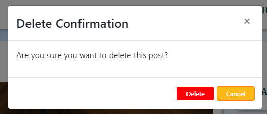
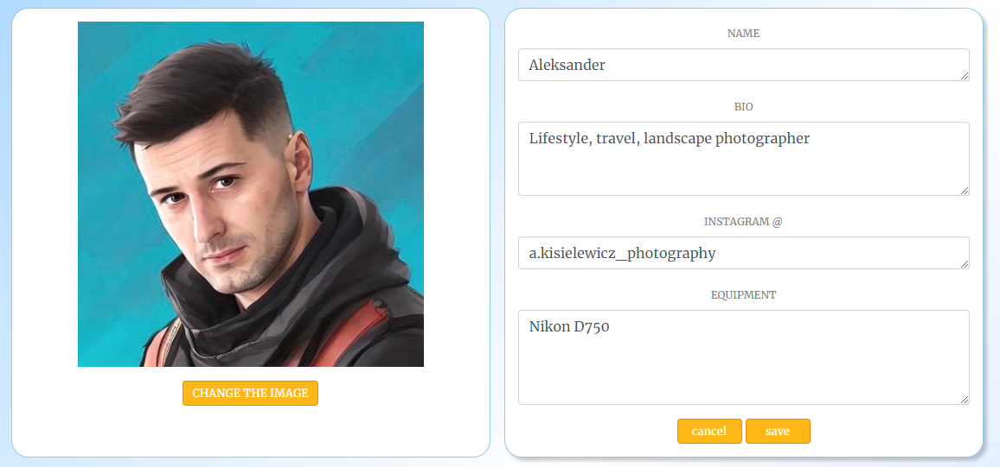
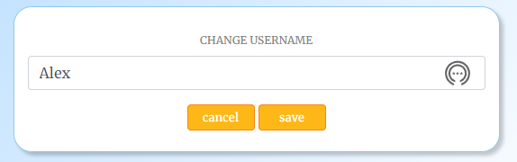

<h1 align="center">"Travel Shutter" React App</h1>

<h3 align="center">React JS, HTML5, CSS3, Bootstrap, JavaScript, Heroku</h3>

<br>

**Developer:** Aleksander Kisielewicz

**[View live website here](https://travel-shutter.herokuapp.com/)** :computer:


Travel Shutter Website was created as Portfolio Project #5 (Advanced front-end/React) for Diploma in Full Stack Software Development at [Code Institute](https://www.codeinstitute.net). The back-end for this application is provided by the DRF TravelShutter API, which is a part of this project and can be found in separate repository, links below:

- Back-end repository: [https://github.com/alexkisielewicz/drf-travelshutter](https://github.com/alexkisielewicz/drf-travelshutter)
- Back-end deployment: [https://drf-travelshutter.herokuapp.com/](https://drf-travelshutter.herokuapp.com/)

Project purpose:

"In this project, you will design and build a content-sharing web application with React and an API (Django Rest Framework) Back-End. This will allow your users to browse and comment/ like each other's content as well as add, edit and delete their own. The users will also be able to follow one another.

The data is presented in a way that makes it easy for users to find what they're looking for."

Application offers such functionalities as:

- **User registration** - Users can register in the app filling in the form with username and password
- **Sign in/out** - Users can conveniently sign in and out of their account
- **User Profile** - Users can change profile details, username and the password and view own posts in the profile
- **Post management** - Users can add, update, and delete their posts with ease (CRUD)
- **Commenting** - Users can leave comments on posts, update or delete them
- **Liking** - Users can add likes to posts to show their appreciation
- **Following** - User can follow other users and display filtered content created by followed authors
- **Filtering content** - Users can apply filters to display categorized posts
- **Search option** - Users can search posts by title, author, category  
- **Messages/feedback** - Users receive feedback and confirmation to their actions in the app.

# Table of content

- [Project](#project)
  - [Strategy/Scope](#strategyscope)
  - [Agile Methodology for project planning](#agile-methodology-for-project-planning)
  - [User stories](#user-stories)
  - [Wireframes](#wireframes)
- [User Experience (UX/UI)](#user-experience-ux)
  - [Colour Scheme](#colour-scheme)
  - [Typography](#typography)
- [Logic and features](#logic-and-features)
  - [Database model and database structure](#data-model-ad-database-structure)
  - [Features](#features)
    - [Navbar and menu](#navbar-and-main-menu)
    - [Homepage](#home-page)
    - [Side menu](#side-menu)
    - [Categories panel](#categories-panel)
    - [Profiles to follow](#profiles-to-follow)
    - [Trending posts](#trending-posts)
    - [Sign up/sign in](#sign-up--sign-in)
    - [Search bar and categories filter](#search-bar-and-categories-filter)
    - [Post page](#post-detailed-view)
    - [Add/edit post](#addedit-post)
    - [Profile page](#profile)
    - [Feedback messages](#feedback-messages)
    - [Not found/404 page](#not-found---404-page)
    - [Form validation](#form-validation)
- [React architecture and components](#react-architecture-and-components)
- [Technology](#technology)
  - [Software used](#software-used)
  - [Python libraries/modules](#python-librariesmodules)
- [Testing](#testing)
  - [Manual testing](#manual-testing)
  - [Bugs/known issues](#bugsknown-issues)
- [Deployment](#deployment)
  - [Database](#database-elephangsql)
  - [Cloudinary](#cloudinary)
  - [Django secret key](#django-secret-key)
  - [Github and Gitpod](#github-and-gitpod)
  - [Heroku](#heroku)
- [Possible future development](#possible-future-development)
- [Credits](#credits)
  - [Code](#code)
  - [Media](#media)
  - [Acknowledgements](#acknowledgements)

# Project

## Strategy/Scope

I opted to develop a web application with real-life usability. My primary objective was always to deliver an exceptional user experience. Hence, I decided to create a web app that is both practical and visually appealing. "Travel Shutter" is a user-friendly website where users can share their travel moments through captivating posts comprising images and text.

The application aims to provide a sleek and intuitive user interface, ensuring easy accessibility and seamless navigation across all features. Moreover, it is designed to be responsive, adapting to various screen sizes and devices.

The website caters to a diverse audience passionate about travel, photography, and sharing their stories through captivating visuals.

To achieve the strategy goals I implemented following features:

- a clean and intuitive user interface for ease of navigation and readability,
- user authentication,
- a menu that provides easy access to all website sections, including personalized content for logged in users,
- cloud hosting of images for optimized website speed and user experience,
- CRUD functionality for posts and comments,
- feedback messages to users for all important actions taken on the website,
- deletion confirmation for posts and comments as a form of defensive programming,
- responsiveness across various platrofms and devices.

## Agile Methodology for project planning

During the development of my website, I used the agile methodology. With a focus on delivering essential functionalities, I employed a prioritization system categorizing features as "must-have" or "could-have." This allowed me to allocate resources effectively and plan for future developments.

To guide my development process, I created user stories and added them to the kanban board divided into following sections: "to do", "in progress" "done", "future enhancements" and "bugs" that allowed to visualize all tasks and prioritize next steps.
I utilized milestones to group basic functionalities into groups and keep track of them completion.
By using agile methodology, I was able to stay organized and focused on delivering the most important features, while also allowing flexibility for future development. This experience gave me valuable insight and lessons that I can apply to future projects.

[Project @GitHub](https://github.com/users/alexkisielewicz/projects/4)


### User stories

| Milestone  | User story |
|------------|------------|
| Navigation | [#1](https://github.com/alexkisielewicz/travel-shutter/issues/1) As a user, I can view a navbar from every page, so that I can easily navigate between pages. |
|            | Acceptance criteria:                                                          |
|            | - The navbar is consistently displayed at the top of each page.               |
|            | - The navbar contains navigation links to different pages of the application. |
| Navigation | [#7](https://github.com/alexkisielewicz/travel-shutter/issues/7) As a logged-out user, I can see sign-in and sign-up options, so that I can sign in or sign up. As a logged-in user, I can see the sign-out link. |
|            | Acceptance criteria:                                                          |
|            | - The navigation UI displays the sign-in and sign-up links when the user is not logged in. |
|            | - Clicking on the sign-in or sign-up option redirects the user to the corresponding auth. page. |
|            | - The navigation UI displays the sign-out link for logged-in users. |
|            | - Clicking on the sign-out link ends the user session and redirects to the home page. |
| Navigation | [#2](https://github.com/alexkisielewicz/travel-shutter/issues/2) As a user, I can navigate through pages quickly without page refresh, so that I can seamlessly view content. |
|            | Acceptance criteria:                                                           |
|            | - Clicking on a navigation link updates the content on the page without reloading the entire page. |
|            | - The browser's back and forward buttons work correctly, allowing the user to navigate through the application's history. |
| Authentication | [#3](https://github.com/alexkisielewicz/travel-shutter/issues/3) As a user, I can create a new account, so that I can access all the features for signed-up users. |
|            | Acceptance criteria:                                                          |
|            | - The sign-up form includes the required fields such as username and password with confirmation. |
|            | - Upon successful sign-up, the user is redirected to the application's sign-in page. |
| Authentication | [#4](https://github.com/alexkisielewicz/travel-shutter/issues/4) As a user, I can sign in to the app, so that I can access functionality for logged-in users.  |
|            | Acceptance criteria:                                                           |
|            | - The sign-in form includes fields for entering the username/email and password. |
|            | - Upon successful sign-in, the user is redirected to their personalized dashboard or the last visited page. |
| Authentication | [#5](https://github.com/alexkisielewicz/travel-shutter/issues/5) As a user, I can see if I am logged in or not, so that I can log in if I need. |
|            | Acceptance criteria:                                                           |
|            | - The user's logged-in status is confirmed by displaying a profile picture in the navbar. |
|            | - The user's logged-in status is persistent across different pages and remains consistent during their session. |
|            | - Default profile picture is present if the user didn't upload their own picture. |
| Authentication | [#6](https://github.com/alexkisielewicz/travel-shutter/issues/6) As a user, I can maintain a logged-in status until I decide to log out so that my user experience is not compromised. |
|            | Acceptance criteria:                                                           |
|            | - Access tokens are automatically refreshed before they expire, ensuring the user remains logged in without interruption. |
|            | - The user is not required to manually refresh or reauthenticate frequently, providing a seamless and uninterrupted user experience. |
|            | - Local storage is used for token storage. |
| User interface | [#8](https://github.com/alexkisielewicz/travel-shutter/issues/8) As a user, I can view profile avatars, so that I can easily identify users of the application. |
|            | Acceptance criteria:                                                           |
|            | - User avatars are displayed next to user profiles, posts, or comments. |
|            | - Avatars are visually distinct and represent the user's identity or chosen profile picture. |
|            | - Standard placeholder image is present if the user didn't upload their own picture. |
| Posts | [#9](https://github.com/alexkisielewicz/travel-shutter/issues/9) As a logged-in user, I can create posts, so that I can share my images in the app. |
|            | Acceptance criteria:                                                           |
|            | - A form is provided for users to enter the necessary details for creating a post, such as an image, title, category, tags, equipment, and post body |
|            | - After successfully creating a post, it is displayed on the posts page. |
| Posts | [#10](https://github.com/alexkisielewicz/travel-shutter/issues/10) As a user, I can view the details of a single post, so that I can learn more about it. |
|            | Acceptance criteria:                                                           |
|            | - Clicking on a post's title or image opens a dedicated page displaying the full details of the post. |
|            | - The post's details are presented in a visually appealing and organized manner for a positive user experience. |
| Posts | [#11](https://github.com/alexkisielewicz/travel-shutter/issues/11) As a logged-in user, I can like a post, so that I can show my support for the posts that interest me. |
|            | Acceptance criteria:                                                          |
|            | - Each post displays the number of likes it has received.                                                                             |
|            | - Clicking on a "like" button associated with a post increment the like count and visually indicates that the post has been liked by the user. |
|            | - Users cannot like their own posts. |
|            | - Unauthorized users are not allowed to add likes. |
|            | - Appropriate messages are displayed in the UI e.g. "Please sign in to add like". |
| Posts | [#12](https://github.com/alexkisielewicz/travel-shutter/issues/12) As a user, I can view all the most recent posts, ordered by the most recently created first, so that I am up to date with the newest content. |
|            | Acceptance criteria:                                                           |
|            | - The posts are listed in descending order based on their creation timestamp, with the most recent posts appearing first. |
|            | - The posts page automatically updates to reflect any new posts that have been added since the user last visited the page. |
| Posts | [#13](https://github.com/alexkisielewicz/travel-shutter/issues/13) As a user, I can search for posts with keywords, so that I can find the posts by title, username, or category they have been posted in. |
|            | Acceptance criteria:                                                          |
|            | - A search bar is provided where users can enter keywords to search for relevant posts. |
|            | - The search functionality returns posts that match the entered keywords (title, username, and category filters are in use). |
|            | - Feedback is provided in the UI if there are no results. |
|            | - Search request to the back-end is delayed after a keystroke so there are no unnecessary requests. |
| Posts | [#14](https://github.com/alexkisielewicz/travel-shutter/issues/14) As a user, I can select a category from the menu, so that I can find all the posts from the category that I am interested in. |
|            | Acceptance criteria:                                                           |
|            | - A button with a category dropdown menu is provided on the posts page. |
|            | - Selecting specific category filters posts on the posts page. |
|            | - The user can remove the category filter by selecting the "display all" option. |
|            | - Currently displayed category name is present in the UI. |
| Posts | [#15](https://github.com/alexkisielewicz/travel-shutter/issues/15) As a logged-in user, I can view the posts I liked, so that I can find the posts I interacted with by adding a like. |
|            | Acceptance criteria:                                                           |
|            | - A dedicated page with active posts filter is available where the user can view all the posts they have liked. |
|            | - Liked posts are clearly marked from other posts, indicating that they have been liked by the user. |
| Posts | [#17](https://github.com/alexkisielewicz/travel-shutter/issues/17) As a user, I can keep scrolling through the posts on the website, which are loaded automatically, so I don't have to use pagination. |
|            | Acceptance criteria:                                                           |
|            | - As the user scrolls down the page, additional posts are loaded and displayed on the posts list. |
|            | - The infinite scroll feature works efficiently, loading new content quickly and without causing performance issues. |
| Posts | [#19](https://github.com/alexkisielewicz/travel-shutter/issues/19) As the post owner, I can edit post details and image, so that I can make corrections or update my post after it was created. |
|            | Acceptance criteria:                                                           |
|            | - The post page includes an "Edit" button that allows the post owner to modify the post's details. |
|            | - After successfully editing the post, the updated information is reflected on the post page. |
| Following users | [#16](https://github.com/alexkisielewicz/travel-shutter/issues/16) As a logged-in user, I can view content filtered by the users I follow, so that I can keep up to date with what they are posting about. |
|            | Acceptance criteria:                                                           |
|            | - The feed page filters the displayed content to only show posts from the users the logged-in user is following. |
|            | - The filtered content is updated dynamically as the logged-in user follows or unfollows other users. |
| Comments | [#18](https://github.com/alexkisielewicz/travel-shutter/issues/18) As a user, I can view the comments about a post, so that I can read what other users think about it. |
|            | Acceptance criteria:                                                           |
|            | - The post page displays all comments associated with the post in order by creation date. |
|            | - Each comment includes the author's username, avatar, timestamp, and comment content. |
| Comments | [#20](https://github.com/alexkisielewicz/travel-shutter/issues/20) As a logged-in user, I can add comments to a post, so that I can share my thoughts about it. |
|            | Acceptance criteria:                                                           |
|            | - A comment input field is available on the post page, allowing users to enter their comments. |
|            | - After submitting a comment, it is immediately displayed in the list of comments, reflecting the user's input. |
| Comments | [#21](https://github.com/alexkisielewicz/travel-shutter/issues/21) As a user, I can see how long ago a comment was made, so that I know how old a comment is. |
|            | Acceptance criteria:                                                           |
|            | - Each comment on the post page includes a timestamp indicating when the comment was posted. |
|            | - The comment's timestamp is presented in a user-friendly format, such as "X minutes/hours/days ago." |
| Comments | [#22](https://github.com/alexkisielewicz/travel-shutter/issues/22) As the owner of a comment, I can delete my comment, so that I can control the removal of my comment from the application. |
|            | Acceptance criteria:                                                           |
|            | - Each comment includes a "Delete" button or similar option for the comment owner to remove their own comment. |
|            | - After confirming the deletion, the comment is immediately removed from the post page. |
| Comments | [#23](https://github.com/alexkisielewicz/travel-shutter/issues/23) As the owner of a comment, I can edit my comment, so that I can update it or correct entered text. |
|            | Acceptance criteria:                                                           |
|            | - Each comment includes an "Edit" button for the comment owner to edit their own comment.|
|            | - After editing and saving changes, the comment is immediately visible on the post page with updated data. |
| Profiles | [#24](https://github.com/alexkisielewicz/travel-shutter/issues/24) As a user, I can view other user's profiles, so that I can see their posts and learn more about them. |
|            | Acceptance criteria:                                                           |
|            | - Each user has a dedicated profile page that displays relevant information about the user, such as their username, avatar, bio, and statistics. |
|            | - The profile page provides a visually appealing layout that showcases the user's posts and other relevant details. |
| Profiles | [#25](https://github.com/alexkisielewicz/travel-shutter/issues/25) As a user, I can see a list of the most followed profiles, so that I can discover popular profiles. |
|            | Acceptance criteria:                                                           |
|            | - A component is available that displays a list of profiles sorted by the number of followers. |
|            | - Each profile in the list includes the user's avatar, username, and follower a button to allocate follow/unfollow links. |
| Profiles | [#26](https://github.com/alexkisielewicz/travel-shutter/issues/26) As a user, I can view statistics about a specific user, including their bio, number of posts, follows, and users followed, so that I can learn more about them. |
|            | Acceptance criteria:                                                           |
|            | - The user's profile page displays the user's bio, providing insights into their interests, background, or any other relevant information. |
|            | - User statistics, such as the total number of posts created, followers, and following, are clearly presented on the profile page. |
| Profiles | [#27](https://github.com/alexkisielewicz/travel-shutter/issues/27) As a logged-in user, I can follow and unfollow other users, so that I can see and remove posts by specific users in my posts feed. |
|            | Acceptance criteria:                                                           |
|            | - Each user profile includes an option to follow or unfollow the respective user, such as a "Follow" or "Unfollow" button. |
|            | - After following a user, their posts are included in the logged-in user's posts feed, and their updates appear in the follower's notifications, posts are not displayed in the profile when the user is unfollowed thereafter. |
| Profiles | [#28](https://github.com/alexkisielewicz/travel-shutter/issues/28) As a user, I can view all the posts by a specific user, so that I can catch up on their latest posts or decide to follow them. |
|            | Acceptance criteria:                                                           |
|            | - The user's profile page provides a section that displays all the posts created by that user. |
| Profiles | [#29](https://github.com/alexkisielewicz/travel-shutter/issues/29) As a logged-in user, I can edit my profile, so that I can change my profile picture and other details. |
|            | Acceptance criteria:                                                           |
|            | - The profile page includes an "Edit Profile" button or similar option that allows the logged-in user to modify their profile information. |
|            | - The edit functionality enables users to update their profile picture or any other relevant details and immediately reflects the changes on their profile page. |
| Profiles | [#30](https://github.com/alexkisielewicz/travel-shutter/issues/30) As a logged-in user, I can change my username and password, so that I can change my display name and keep my profile secure. |
|            | Acceptance criteria:                                                           |
|            | - The profile page provides a link to update the user's username and password. |
|            | - Users can enter their new username and password, and after successfully updating the information, the changes take effect, allowing them to log in with the new credentials. |
| Improvements | [#31](https://github.com/alexkisielewicz/travel-shutter/issues/31) As a user, I want to see a deletion confirmation message when attempting to delete an item that I created, so that I can ensure that I intend to delete the item before proceeding. |
|            | Acceptance criteria:                                                           |
|            | - The deletion confirmation message is shown in the user interface, providing a clear indication of the deletion action and the item being deleted. |
|            | - The user is presented with options to confirm or cancel the deletion operation. |
|            | - If the user confirms the deletion, the item is permanently removed from the database. |
|            | - If the user cancels the deletion, they are redirected to the last visited page without deleting the item. |
|            | - The deletion confirmation functionality is applied consistently for both post and comment deletion actions, ensuring a uniform user experience across the app. |
| Improvements | [#32](https://github.com/alexkisielewicz/travel-shutter/issues/32) As a user, I want to receive feedback as a response to my actions, so that I can have a clear understanding of the outcome of my actions and stay informed. |
|            | Acceptance criteria:                                                           |
|            | - Feedback messages are displayed in the form of a toast UI component that disappears automatically after a short time. |
|            | - Appropriate message is displayed on such occasions as sign-in/out, creation of an account, adding a post, editing a post, adding or deleting the comment, editing profile details, username, or password. |
|            | - The confirmation toast message is shown to the user only when the action performed results in a successful change in the database. |
| Improvements | [#33](https://github.com/alexkisielewicz/travel-shutter/issues/33) As a user, I want to be able to click on a post category, so that I can view all posts belonging to that category on the posts page with the category filter applied. |
|            | Acceptance criteria:                                                           |
|            | - The post categories are displayed in the UI. |
|            | - When a user clicks on a category, they are redirected to the posts page. |
|            | - The posts page is loaded with the applied filter for the selected category. |
|            | - The selected category is displayed on the posts page to indicate the active filter. |
|            | - Only posts belonging to the selected category are shown on the posts page. |
| Improvements | [#34](https://github.com/alexkisielewicz/travel-shutter/issues/34) As a user, I want to see the top 5 posts with the most likes, so that I can quickly access popular and engaging content. |
|            | Acceptance criteria:                                                           |
|            | - Top 5 posts with the most likes are displayed in the UI. |
|            | - Each post is a clickable link, allowing the user to be redirected to the post page. |
|            | - The number of likes for each post is visible next to the link or post title. |
| Improvements | [#35](https://github.com/alexkisielewicz/travel-shutter/issues/35) As a user, I can add tags to the posts and view the list of the posts associated with specific tags, so I can browse posts that I am interested in. |
|            | Acceptance criteria:                                                           |
|            | - Tag field is present in add post form. |
|            | - User can add multiple tags, separated with commas. |
|            | - Tags belonging to specific posts are displayed in this post detailed view. |
|            | - User can click on a tag and get redirected to a filtered post list view with posts marked with this tag. |
## Wireframes

[Wireframes - PDF File](docs/************.pdf)

# User Experience (UX)

## Colour Scheme

Colour palette was selected using coolors.co generator from among trending colour sets.


- #8ECAE6 - soft blue
- #219EBC - strong cyan
- #023047 - dark navy
- #FFB703 - vivid orange
- #FB8500 - pure orange

## Typography

The [Merriweather](https://fonts.google.com/specimen/Merriweather) font is the main font used throughout the whole website with Sans Serif as the fallback. Merriweather is a clean, modern looking and well known font. It is sourced from Google fonts and it's linked to css document via @import method.


The [Playfair Display S](https://fonts.google.com/specimen/Playfair+Display+SC?query=Playfair+Display+S) font was chosen for posts headings. It is a serif typeface known for its elegant and sophisticated appearance. The "S" in Playfair Display S stands for "Small Caps," indicating that it includes small capital letters as an alternative to the regular uppercase letters. This font is often favored for projects that require a classic and timeless look, such as editorial designs, branding, and luxury products.


Example header and paragraph:


# Logic and features

## Data model ad database structure

Project uses cloud-based PostgreSQL database provided by [ElephantSQL](https://www.elephantsql.com/) as a service. More information can be found in back-end application repository [here](https://github.com/alexkisielewicz/drf-travelshutter#data-model-ad-database-structure)

## Features

### Navbar and main menu

The navbar in the app is implemented using Bootstrap. It provides a user-friendly and intuitive navigation experience. Navbar is one common element for all the pages, it is visible in the viewport at all times. The navbar consists of a logo on the left side, and navigation links on the right side. It is designed to be responsive and collapsible on mobile devices, ensuring a seamless user experience across different screen sizes.

Not authenticated users can see sign in and sign up links:


For logged-in users, the navbar displays the profile avatar and username, allowing users to quickly identify their account. Both avatar and username are clickable links that take users to their profiles from where they can browse own posts or change profile details including credentials.


Mobile navbar and menu:


### Home page

On the home page users will find a layout with two columns for bigger devices that becomes one column on mobile devices.


The left column contains a list of all the posts, and it uses infinite scroll feature for seamless user experience without the need for pagination. At the top of the posts section, there is a dropdown menu containing categories filters, enabling users to filter the displayed posts based on specific categories. Next to that menu, there is a search bar that allows users to search for posts. Clicking on a post will redirect the user to a dedicated page displaying the detailed view of that specific post. Categories menu and search bar are available on mobile devices above list of all posts.
### Side menu

The right column contains a panel with menu specifically designed for logged-in users. This panel includes links to various sections. Users can find links to add a new post, access their personalized user feed, and view their liked posts. The user feed displays a list of posts from the users they follow, ensuring they stay up to date with the content that interests them. The liked posts section gives users a way to revisit the posts they have previously liked. This menu panel on mobile devices is placed above list all posts and takes full width of a screen.


There are also three separate panels displayed in this section. The first panel showcases button with categories, user can click on a selected caategory and will be redirected to the list of posts filtered by selected category. Second panel displays profiles to follow, suggesting users to connect with and explore their posts. The third panel highlights trending posts in the list ordered by criterium of likes count. It allowing users to discover popular and engaging content.

### Categories panel


I have decided to include the "Profiles to Follow" panel in the mobile view. It is positioned below the menu component and above the categories filters and search bar. However, only four profiles are displayed in the mobile view, compared to the ten profiles shown in the desktop view. The categories panel and trending posts are not available in the mobile view due to design constraints. The functionality of the categories panel is already accessible through the categories dropdown menu. Placing the trending posts in the single-column view would occupy too much space, which could compromise the user experience before reaching the main feature and purpose of the app, which is the list of posts with images that user share.

### Profiles to follow

The "Profiles to Follow" component displays a list of 10 profiles, ordered based on the number of followers. Each profile includes a follow/unfollow link, allowing users to easily choose to follow or unfollow a particular profile. This component helps users discover and connect with other users of the app.


### Trending Posts

The "Trending Posts" panel showcases the top five most liked posts. These posts are ordered based on the number of likes they have received. Each post is displayed as a link, allowing users to easily access and explore the popular content.


### Sign up / sign in

The sign-up page provides users with a straightforward process to create a new account. The page layout includes cover photo and registration form, which allows users to input their username, password, and password confirmation. The form ensures that the user chooses a unique username and provides a secure password. The password confirmation field serves as an additional step to prevent any typing errors while entering the password. Upon clickin on  "Sign Up" button profile is created and user is redirected to sign in page. Additionally, for users who already have an account and need to sign in, there is provided link to sign in page.


The sign-in page allows users with existing accounts to access their personalized content and features.
On the page users will find a cover photo, similar in style to the sign-up page and login form, which prompts users to enter their username and password. Click on the "Sign In" button validates credentials and authenticates user to acces the page. For users who don't have an account, there is provided a link to the sign-up.


### Search bar and categories filter

Above the posts list there are categories filter and search bar. Categories filter is placed in dropdown menu and contains a list of options with all available post categories. User can select any category and will be redirected to the page with posts filtered view. Currently selected category is displayed in the dropdown button, user can remove filter by selecting "Display all" option.


Next to the categories dropdown menu there is a search bar where user can type a keyword and backend application filters are applied. User can search posts by entering post title, user name or post category. A small delay is applied before api request is sent. That prevents requests being sent after each keystroke and in result an excessive use of backend application.


### Post detailed view

The post detailed view is placed in Bootstrap card component and provides users with all the details about specific post. At the center of the card, there is post image associated with the post. Sharing photos is one of the main purposes of this app, however placeholder image is provided by backend application if user decide not to upload own image.

In the top left corner of the card, there is the post author's avatar and username. On the right users can find the post update timestamp. Below the image, there is a heading that displays the post title. A paragraph below the heading presents the post content, allowing users to read the story or image description provided by the author.

Underneath the post content, the post details section provides more information and includes post category, tags and image exif data. This data provides technical details about the image, such as the camera model, lens, aperture, exposure time, etc. Users who are interested in the technical aspects of photography would appreciate such description.

Bottom section presents icons that represent the likes and comments on the post. These icons are accompanied by the respective counts, indicating the number of likes and comments. Authenticated user can click on a heart to add or remove like. Liking own posts is not allowed, also not-authenticated users are not allowed to interact with likes. In both cases there is an information provided in bootstrap tooltip component.


Authenticated user who is an author of the post can see dropdown menu that allows to edit or delete post. 


Modal with confirmation is diplayed before post is deleted to ensure that operation is intended.



### Comments

Below the post there is a comments section with list of all post comments. It utilizes infinite scroll for seamless user experience without need for pagination. Comment form allows authenticated users to write and add a comment. Each comment is placed in a paragraph containing authors avatar, username and creation time in a user friendly format.


Authenticated user who is an author of a comment can also edit or delete own comment. Deletion confirmation is provided in bootstrap modal component as a form of defensive programming to ensure that comment is not deleted by mistake.


Comment form (and comment edit form) includes helpful characters counter that indicates how many characters left to write in the input field until maximum length of the comment is reached. In case than comment exceeds allowed maximum length of 300 characters, there is message "Comment too long!" displayed and submit button is disabled.


### Add/Edit Post

The "Add Post" includes a form that allow users to upload an image and write other details for their post. The image upload is validated to ensure it meets the specified requirements, including a maximum size of 2MB and dimensions of up to 2500px in height and width. Placeholder image is provided by backend if user do not upload own image.

The form includes also following fields; title, category, tags, exif and content. All fields are validated to match specific regular expressions. The tags can be entered as a comma-separated list of words. The backend automatically handles the addition or removal of commas and eliminates duplicate tags. Handy tooltip is available next to the exif input label to provide more information to the user about field purpose.

An authenticated user who is the author of a post has the ability to edit their own post. A similar form is provided, where the existing post image is visible. The user can choose to either change the image or upload a new one. All text fields can be updated, and they are validated using regular expressions. In case of any errors, they are displayed below each input field, providing the user with feedback regarding allowed characters, length restrictions, and file size requirements.


### Profile

The user profile page features the user's avatar, username, and statistics that includes the number of created posts, count of followers, and following users. In the center there is a section for the user's bio information. Below there are further details such as instagram handle with link to instagram and user's equipment. In the top right corner, there is a follow/unfollow button for interacting with the user's profile. Below the profile container, there is a list of all posts created by the user, it utilizes infinite scroll for seamless experience.


Authenticated users can see dropdown menu in their profiles that allows them to edit profil information and change credentials.


Edit profile form allows user to change existing image and all other text fields. The form is validated and each input is chacked againts regular expression. Errors, if occurs, are displayed below each input giving user feedback information about allowed characters, length, file size, etc.






### Feedback Messages

Feedback messages are displayed in a toast notification that automatically disappears after short time or can be manually dismissed. These messages are shown on various occasions such as logging in or out, creating an account, adding or editing posts, adding or editing comments, and updating profile changes. They provide relevant information to the user about the status or outcome of their actions in a non-obstructive manner.


### Not found - 404 page

The error page is displayed when a user tries to access a page that does not exist. It features a cover image and provides a link that allows the user to return to the home page without relying on the browser's back button.


### Form validation

There is comprehensive form input validation implemented throughout the application to ensure that inputs are entered correctly and meet the intended criteria. This validation process helps prevent errors and ensures the integrity of the data being submitted. It includes checks for required fields, data formats, length restrictions, and other relevant constraints.

| Input Field | Regular Expression | Allowed length/size/input |
|-------------|--------------------|---------------------------|
| Username    | /^[A-Za-z0-9_]{4,12}$/ | 4-12 |
| Password    | /^[A-Za-z0-9_]{8,16}$/ | 8-16 |
| Post image  |  N/A | 2500 x 2500px, 2MB |
| Post title  | /^[a-zA-Z,. ]{3,100}$/ | 3-100 |
| Post category | N/A | Any option |
| Post tags | /^[a-zA-Z, ]{3,100}$/ | 3-10 |
| Post exif | /^[a-zA-Z0-9\s,.@/-]{3,100}$/ | 3-100 |  
| Post content | /^[a-zA-Z0-9\s.,\-!?]{3,300}$/ | 3-300 |
| Comment | N/A | max. 300 |
| Profile image| N/A | 2500 x 2500px, 2MB |
| Profile name | /^[A-Za-z\s]{1,40}$/ | 1-40 |
| Profile bio| /^[A-Za-z0-9\s,.!]{0,150}$/ | max. 150 |
| Profile instagram| /^[A-Za-z0-9_.]{0,70}$/ and can't include "instagram.com" | max. 70 |
| Profile equipment| /^[A-Za-z0-9\s,.!_]{0,70}$/ | max. 70 |

# React architecture and components

One of the main learning outcomes of this project was to use React JavaScript library and its architecture that utilizes reusable components. React is most popular JavaScript library and promotes code reusability, making it easier to maintain and modularize code.

Application UI is broken down into smaller, reusable components. This modular approach enhances code organization, readability, and reusability. With this in mind developer can maintain a uniform look and feel throughout the application. Updates made to a component are applied universally across UI and take effect on parts of the UI when changes occur, leading to faster rendering and an better user experience over all.

Using contexts, hooks, and properties passing between components enables them to collaborate and share information, ensuring that when changes occur, they update accordingly. The application uses a modular system of CSS stylesheets, with one main stylesheet for the entire application, while each component has its own separate stylesheet.

In my application I also aimed to implement reusable components to avoid repetition in the code, unify UI and optimize app performance. List below describes used created components:

- Asset: A component used for displaying various assets, such as images or messages.

- Avatar: A component that represents a user's avatar or profile picture, typically displayed alongside their username or in user-related sections such as post, comments, profile, profiles to follow.

- CategoriesPanel: A component that presents a panel with categories buttons for filtering posts.

- DropdownMenu: A reusable component that creates a dropdown menu interface, allowing users to select options or navigate through different sections, utilizes by authenticated user to manipulate own content, used in user profile, in post detail view for edit/delete options and in comments section to edit/delete comments.

- InputError: A component that displays an error message or validation feedback related to input fields in forms, helping users understand and correct any errors.

- NavBar: A navigation bar component, providing app logo and links and options for users to navigate through different sections of the app.

- Page404: A component that represents an error or "Not Found" page, displayed when a user tries to access a page or route that does not exist.

- SidePanel: A panel component positioned at the side of the application, used to display menu with links for authenticated user.

- TopPosts: A component that displays list of trending posts, based on number of likes criteria.

- PostContainer: A container component used to display individual posts, repetitively used to displayed iterated posts on post list, posts in user profile, Feed and Liked pages.

- Comment: A container that is repetively used to display comments under each post.

- Profile: A component representing a user's profile page, displaying information such as the user's avatar, username, statistics, bio, instagram link and equipment. Repetively used for each user.

# Technology

## Languages used

- [HTML5](https://en.wikipedia.org/wiki/HTML5) - markup language used for structuring webpage content
- [CSS3](https://en.wikipedia.org/wiki/CSS) - stylesheet language
- [JavaScript](https://en.wikipedia.org/wiki/JavaScript) - high-level, imperative, programming language.
- [Markdown](https://en.wikipedia.org/wiki/Markdown) - markup language used to write README and TESTING documents.

## Software / frameworks / libraries

- [Axios](https://www.npmjs.com/package/axios) - promise based HTTP client for the bowser and node.js
- [Balsamiq](https://balsamiq.com/) - used to create project wireframes
- [Bootstrap 4.6.0](https://react-bootstrap-v4.netlify.app/) - CSS framework developed by Twitter
- [Canva](https://www.canva.com/) - used to design logo picture
- [Coolors.co](https://coolors.co/) - was used to create colour palette for terminal display page
- [CSS Jigsaw Validator](https://jigsaw.w3.org/css-validator/) - validation tool for CSS
- [ESLint](https://eslint.org/) - JavaScript linter, was installed and configured in IDE.
- [Favicon.io](https://www.favicon.io) - tool used to create favicon
- [Font Awesome:](https://fontawesome.com/) - Font Awesome icons were used for social links in terminal display page
- [Git](https://git-scm.com/) - Git was used for version control by utilizing the Gitpod terminal to commit to Git and Push to GitHub
- [GitHub](https://github.com/) - GitHub is used to store the project's code after being pushed from Git
- [Google DevTools](https://developer.chrome.com/docs/devtools/) - used for developing HTML/CSS/DOM navigating/JavaScript console
- [Google Lighthouse](https://developer.chrome.com/docs/lighthouse/overview/) - used for testing website performance
- [Heroku](https://heroku.com) - online app used to deploy project
- [jwt-decode](https://www.npmjs.com/package/jwt-decode) - library that helps decoding JWTs token which are Base64Url encoded
- [Lighthouse](https://chrome.google.com/webstore/detail/lighthouse/blipmdconlkpinefehnmjammfjpmpbjk) - chrome extension to test website performance
- [Pexels](https://www.pexels.com/) - was used to source bacground picture for terminal display page
- [React-infinite-scroll-component](https://www.npmjs.com/package/react-infinite-scroll-component) infinite scroll for posts and comments
- [React router](https://reactrouter.com/en/main) - enables "client side routing".
- [React toastify](https://www.npmjs.com/package/react-toastify) - toasts for feedback messages
- [React JS 17.02](https://legacy.reactjs.org/docs/getting-started.html) - main JavaScript library used for the project
- [Techsini.com](https://techsini.com/multi-mockup/) - website mockup generator
- [W3C HTML Validator](https://validator.w3.org/) - validation tool for HTML
- [WAVE](https://wave.webaim.org/) - web accessibility online tool
- [WebAIM](https://webaim.org/resources/contrastchecker/) - online tool to check colour contrast/accesibility

# Testing

## Manual testing

Details of manual testing can be found in [TESTING.md](TESTING.md) file.

## Bugs/known issues

Minor syntax and spelling errors were eliminated during development in , below is a list of registered issues.

| Issue | Problem | Solution |
|-------|---------|----------|


# Deployment

App was deployed to heroku for the first time when React installation was completed to make sure that everything is working correctly at early stage of development.


## GitHub and Gitpod

Note: Repository was created using Code Institute template: [https://github.com/Code-Institute-Org/gitpod-full-template](https://github.com/Code-Institute-Org/gitpod-full-template)

1. Login to Github and navigate to repository: [https://github.com/alexkisielewicz/photo-adventures](https://github.com/alexkisielewicz/photo-adventures)

2. Click on "Fork button" in upper-right corner and create a new form in your own account.

3. Open your repository in local IDE or using Gitpod. Preferred way is to used [Chrome Gitpod Extension](https://chrome.google.com/webstore/detail/gitpod-always-ready-to-co/dodmmooeoklaejobgleioelladacbeki). When you install extension, green "Gitpod" button appears in your repository. Click on it to cread new workspace.

4. Go to workspace terminal and install all requirements using command: "pip install -r requirements.txt". All te packages will be installed. requirements.txt content:

    ```python
    asgiref==3.6.0
    cloudinary==1.32.0
    crispy-bootstrap5==0.7
    dj-database-url==0.5.0
    dj3-cloudinary-storage==0.0.6
    Django==3.2.18
    django-allauth==0.52.0
    django-crispy-forms==2.0
    django-social-share==2.3.0
    django-summernote==0.8.20.0
    django-taggit==3.1.0
    gunicorn==20.1.0
    oauthlib==3.2.2
    psycopg2==2.9.5
    PyJWT==2.6.0
    python3-openid==3.2.0
    pytz==2022.7.1
    requests-oauthlib==1.3.1
    sqlparse==0.4.3
    ```

5. Local env.py file should be configured as on example below:

    ```python
    import os

    # Env vars
    os.environ["DATABASE_URL"] = "postgres://yourLinkCopiedFromElephantSQLDashboard"
    os.environ["SECRET_KEY"] = "YourSecretKey"
    os.environ["CLOUDINARY_URL"] = "cloudinary://yourLinkCopiedFromCloudinaryDashboard"

    # Gmail vars
    os.environ["EMAIL_HOST_USER"] = "youremail@gmail.com"
    os.environ["EMAIL_HOST_PASSWORD"] = "passwordObtainedFromGoogleAccount"
    os.environ["DEFAULT_FROM_EMAIL"] = "Photo Adventures"
    ```

6. In order to save django changes in database migration needs to be made.

7. Use terminal commands:

    ```text
    python3 manage.py makemigrations
    python3 manage.py migrate
    ```

8. Create superuser to access admin area using terminal command (email is optional, password won't be visible when typing, confirm password twice):

    ```text
    python3 manage.py createsuperuser
    ```

9. App can be run in gitpod enviroment using terminal command:

    ```text
    python3 manage.py runserver
    ```

10. Go to Heroku and follow further instructions below.

## Heroku

1. Navigate to [https://heroku.com/](https://heroku.com/) login to your account and open dashboard. Click button "New" and select "Create new app" button.

2. Enter app name, I used "photo-adventures", chose your region and click on "Create app" button.

3. Click on newly created app and go to "Deploy" tab and then to "Deployment method" section. Authorize and connect your GitHub account, then find and select your repository.

4. Go to the "Settings" tab, click on "Reveal Config Vars" and add the following keys and values (all values should be strings without any quotation marks):

    NOTE: DISABLE_COLLECTSTATIC variable should be set to "1" for initial deployment. Before final deployment it should be removed.

    | Key                    | Value                                                            |
    |------------------------|------------------------------------------------------------------|
    | CLOUDINARY_URL         | cloudinary url beginning with cloudinary://                      |
    | DATABASE_URL           | postgress url beginning with postgress://                        |
    | DEFAULT_FROM_EMAIL     | Photo Adventures                                                 |
    | DISABLE_COLLECTSTATIC  | 1                                                                |
    | EMAIL_HOST_PASSWORD    | YourPassword obtained from Google account                        |
    | EMAIL_HOST_USER        | youremailaccount@gmail.com                                       |
    | PORT                   | 8000                                                             |
    | SECRET_KEY             | YourSecretKey, the same as in env.py                             |

    

5. Return to your Gitpod workspace and navigate to the file `photoadventures/settings.py`. Change allowed hosts including the name of the app that you created in previous steps. In my case, it was 'photo-adventures.herokuapp.com'. Save the file.

    

6. Procfile required to run project on Heroku was already created but if you change your app's name please make sure that this change is reflected in Procfile. It can be found in your project's main directory. In my case Procfile looks as below:

    ```python
    web: gunicorn photoadventures.wsgi
    ```

7. After adding enviromental variables and editing Procfile project is ready for deployment. In Heroku app's dashboard navigate to "Deploy" tab, scroll down to "Manual deploy" section. Select main branch from dropdown menu and click on "Deploy Branch".

8. **Step required for final deployment:** Navigate again to app's settings, reveal config vars and delete DISABLE_COLLECTSTATIC entry if it was set before.

9. After built is done, you should be able to see the button with the link leading to deployed app. In my case [http://photo-adventures.herokuapp.com](http://photo-adventures.herokuapp.com).

# Possible future development

If I had more time or decide to develop app further I would add/improve following functionalities that I moved to [Future enhancements](https://github.com/alexkisielewicz/photo-adventures/issues?q=label%3A%22future+enhancement%22+) column on project board:

- [#29](https://github.com/alexkisielewicz/photo-adventures/issues/29) Similar posts recommendation to suggest user next read
- [#34](https://github.com/alexkisielewicz/photo-adventures/issues/34) Post list by category
- [#35](https://github.com/alexkisielewicz/photo-adventures/issues/35) Post list by author
- [#40](https://github.com/alexkisielewicz/photo-adventures/issues/40) File size/format/dimension validation of uploaded images
- [#41](https://github.com/alexkisielewicz/photo-adventures/issues/41) Featured post - functionality that allows admin to mark selected post as featured and highlight it on main page.

# Credits

## Code

spinner css sourced from https://loading.io/css/


## Media

- [Pexels.com](https://www.pexels.com) - sign in/up cover photos, and other graphics.
- [Alek Kisielewicz Photography](https://www.facebook.com/alex.perfect.photo) - I used my own pictures as a cover images for a number of posts.

## Learning resources

- [Code Institute course and learning platform](https://codeinstitute.net/)
- [W3Schools](https://www.w3schools.com/python/default.asp)
- [React](https://legacy.reactjs.org/docs/getting-started.html) - React documentation.
- [Bootstrap](https://react-bootstrap-v4.netlify.app/getting-started/introduction) - Bootstrap documentation.

## Acknowledgements

- My Mentor Jubril Akolade for helpful feedback and guidance at all stages of the project.
- Code Institute Slack Community for being invaluable knowledge base.

## Disclaimer

- Travel Shutter Website was created for educational purpose only.
