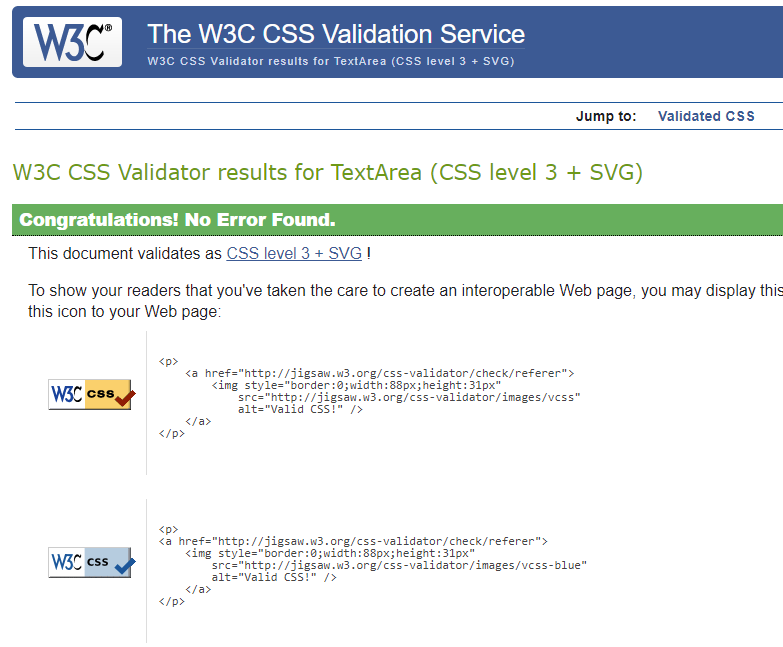
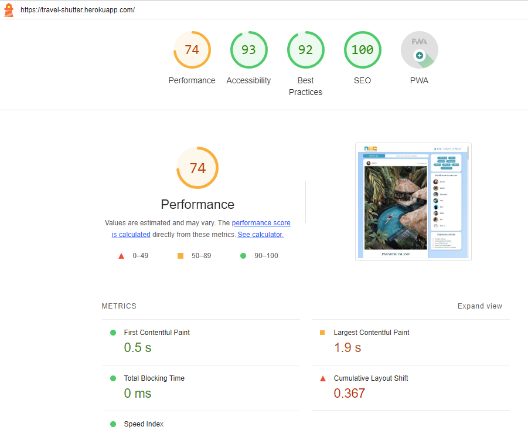
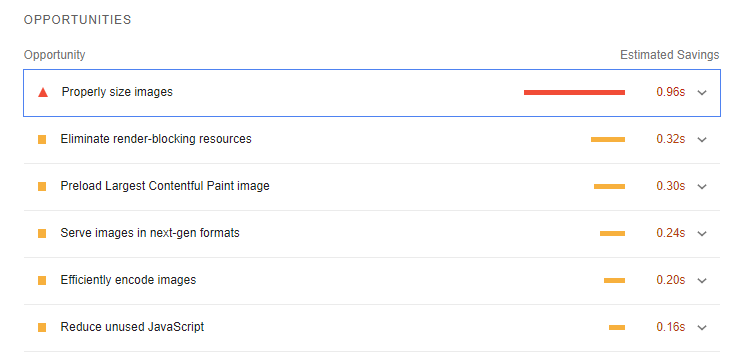

A reasonable amount of manual testing was done and results can be found below:

# Table of content

- [User story testing](#user-story-testing)
- [Functionality testing](#functionality-testing)
- [Responsiveness testing](#responsiveness-testing)
- [Browser compatibility testing](#browser-compatibility-testing)
- [HTML Validation](#html-validation)
- [CSS Validation](#css-validation)
- [JavaScript Validation](#javascript-validation)
- [Lighthouse performance audit](#lighthouse-performance-audit)
- [WAVE Accesibility testing](#wave-accesibility-testing)

# User story testing

| User story | Result     |
|------------|------------|
| [#1](https://github.com/alexkisielewicz/travel-shutter/issues/1) As a user, I can view a navbar from every page, so that I can easily navigate between pages. | PASS |
| [#2](https://github.com/alexkisielewicz/travel-shutter/issues/2) As a user, I can navigate through pages quickly without page refresh, so that I can seamlessly view content. | PASS |
| [#3](https://github.com/alexkisielewicz/travel-shutter/issues/3) As a user, I can create a new account, so that I can access all the features for signed-up users. | PASS |
| [#4](https://github.com/alexkisielewicz/travel-shutter/issues/4) As a user, I can sign in to the app, so that I can access functionality for logged-in users.  | PASS |
| [#5](https://github.com/alexkisielewicz/travel-shutter/issues/5) As a user, I can see if I am logged in or not, so that I can log in if I need. | PASS |
| [#6](https://github.com/alexkisielewicz/travel-shutter/issues/6) As a user, I can maintain a logged-in status until I decide to log out so that my user experience is not compromised. | PASS |
| [#7](https://github.com/alexkisielewicz/travel-shutter/issues/7) As a logged-out user, I can see sign-in and sign-up options, so that I can sign in or sign up. As a logged-in user, I can see the sign-out link. | PASS |
| [#8](https://github.com/alexkisielewicz/travel-shutter/issues/8) As a user, I can view profile avatars, so that I can easily identify users of the application. | PASS |
| [#9](https://github.com/alexkisielewicz/travel-shutter/issues/9) As a logged-in user, I can create posts, so that I can share my images in the app. | PASS |
| [#10](https://github.com/alexkisielewicz/travel-shutter/issues/10) As a user, I can view the details of a single post, so that I can learn more about it. | PASS |
| [#11](https://github.com/alexkisielewicz/travel-shutter/issues/11) As a logged-in user, I can like a post, so that I can show my support for the posts that interest me. | PASS |
| [#12](https://github.com/alexkisielewicz/travel-shutter/issues/12) As a user, I can view all the most recent posts, ordered by the most recently created first, so that I am up to date with the newest content. | PASS |
| [#13](https://github.com/alexkisielewicz/travel-shutter/issues/13) As a user, I can search for posts with keywords, so that I can find the posts by title, username, or category they have been posted in. | PASS |
| [#14](https://github.com/alexkisielewicz/travel-shutter/issues/14) As a user, I can select a category from the menu, so that I can find all the posts from the category that I am interested in. | PASS |
| [#15](https://github.com/alexkisielewicz/travel-shutter/issues/15) As a logged-in user, I can view the posts I liked, so that I can find the posts I interacted with by adding a like. | PASS |
| [#16](https://github.com/alexkisielewicz/travel-shutter/issues/16) As a logged-in user, I can view content filtered by the users I follow, so that I can keep up to date with what they are posting about. | PASS |
| [#17](https://github.com/alexkisielewicz/travel-shutter/issues/17) As a user, I can keep scrolling through the posts on the website, which are loaded automatically, so I don't have to use pagination. | PASS |
| [#18](https://github.com/alexkisielewicz/travel-shutter/issues/18) As a user, I can view the comments about a post, so that I can read what other users think about it. | PASS |
| [#19](https://github.com/alexkisielewicz/travel-shutter/issues/19) As the post owner, I can edit post details and image, so that I can make corrections or update my post after it was created. | PASS |
| [#20](https://github.com/alexkisielewicz/travel-shutter/issues/20) As a logged-in user, I can add comments to a post, so that I can share my thoughts about it. | PASS |
| [#21](https://github.com/alexkisielewicz/travel-shutter/issues/21) As a user, I can see how long ago a comment was made, so that I know how old a comment is. | PASS |
| [#22](https://github.com/alexkisielewicz/travel-shutter/issues/22) As the owner of a comment, I can delete my comment, so that I can control the removal of my comment from the application. | PASS |
| [#23](https://github.com/alexkisielewicz/travel-shutter/issues/23) As the owner of a comment, I can edit my comment, so that I can update it or correct entered text. | PASS |
| [#24](https://github.com/alexkisielewicz/travel-shutter/issues/24) As a user, I can view other user's profiles, so that I can see their posts and learn more about them. | PASS |
| [#25](https://github.com/alexkisielewicz/travel-shutter/issues/25) As a user, I can see a list of the most followed profiles, so that I can discover popular profiles. | PASS |
| [#26](https://github.com/alexkisielewicz/travel-shutter/issues/26) As a user, I can view statistics about a specific user, including their bio, number of posts, follows, and users followed, so that I can learn more about them. | PASS |
| [#27](https://github.com/alexkisielewicz/travel-shutter/issues/27) As a logged-in user, I can follow and unfollow other users, so that I can see and remove posts by specific users in my posts feed. | PASS |
| [#28](https://github.com/alexkisielewicz/travel-shutter/issues/28) As a user, I can view all the posts by a specific user, so that I can catch up on their latest posts or decide to follow them. | PASS |
| [#29](https://github.com/alexkisielewicz/travel-shutter/issues/29) As a logged-in user, I can edit my profile, so that I can change my profile picture and other details. | PASS |
| [#30](https://github.com/alexkisielewicz/travel-shutter/issues/30) As a logged-in user, I can change my username and password, so that I can change my display name and keep my profile secure. | PASS |
| [#31](https://github.com/alexkisielewicz/travel-shutter/issues/31) As a user, I want to see a deletion confirmation message when attempting to delete an item that I created, so that I can ensure that I intend to delete the item before proceeding. | PASS |
| [#32](https://github.com/alexkisielewicz/travel-shutter/issues/32) As a user, I want to receive feedback as a response to my actions, so that I can have a clear understanding of the outcome of my actions and stay informed. | PASS |
| [#33](https://github.com/alexkisielewicz/travel-shutter/issues/33) As a user, I want to be able to click on a post category, so that I can view all posts belonging to that category on the posts page with the category filter applied. | PASS |
| [#34](https://github.com/alexkisielewicz/travel-shutter/issues/34) As a user, I want to see the top 5 posts with the most likes, so that I can quickly access popular and engaging content. | PASS |
| [#35](https://github.com/alexkisielewicz/travel-shutter/issues/35) As a user, I can add tags to the posts and view the list of the posts associated with specific tags, so I can browse posts that I am interested in. | Feature marked as future enhancement |

# Functionality testing

Comprehensive testing has been conducted to ensure that all website functionalities are working as intended, providing users with a reliable and enjoyable browsing experience.

| Functionality | What's being tested | Result |
|------|-------------|--------|
| Registration / Sign up page | A new user can create an account successfully. | PASS |
|  | The website validates user inputs (username, 2 password inputs match). | PASS |
|  | The website displays an appropriate error message with hint when validation fails. | PASS |
|  | The website displays a message in a toast when registration is successfull | PASS |
| Authentication / Sign in/out | A registered user can log in successfully using username and password | PASS |
|  | The website displays an appropriate error message when a user enters an incorrect username or password. | PASS |
|  | A logged-in user can sign out successfully. | PASS |
|  | The website displays an appropriate message in a toast when user sings in/out succesfully. | PASS |
| Posts CRUD | Logged-in user can create a new post using form provided | PASS |
|  | The website displays a message in a toast when post is created | PASS |
|  | The website displays an appropriate error message when a user enters invalid data (e.g., blank title, too long input, not allowed charset). | PASS |
|  | A user can add new post without own picture, placeholder image is displayed | PASS |
|  | A user can add new post uploading own picture | PASS |
|  | Uploaded image file is being validated and app do not accept images exceeding 2MB in filesize and 2500px in width and height | PASS |
|  | Appropriate error message is displayed if image do not pass validation | PASS |
|  | A user can edit own post providing new values for each of text inputs and save changes | PASS |
|  | A user can edit own post by changeing an post image, validation is applied on every form submission | PASS |
|  | The website displays a message in a toast when changes are saved | PASS |
|  | A user cannot edit or delete another user's posts (checked manual url change). 404 page is being displayed | PASS |
|  | A user can delete own post upon clicking on confirmation button | PASS |
|  | Post is not deleted if user click on "cancel" in confirmation modal, user is redirected back | PASS |
|  | The website displays a message in a toast when post is deleted | PASS |
|  | The website displays new post end edited post correctly (including image, title, category, tags, exif, likes, comments). | PASS |
| Profile edit | A logged-in user can edit own profile and save changes | PASS |
|  | User can change all text inputs (name, bio, instagram handle, equipment) and save changes. | PASS |
|  | User can change profile image and save changes. | PASS |
|  | Image validation works properly and displays error message if filesize or image dimensions are exceeded. | PASS |
|  | The website displays a message in a toast when changes are saved. | PASS |
|  | User can update username and save changes | PASS |
|  | User can update password and save changes | PASS |
|  | The website displays a message in a toast when changes are saved both for username and password | PASS |
| Comments CRUD | A logged-in user can add a comment to a post. | PASS |
|  | Anonymous user can not post comments. | PASS |
|  | The website displays all comments correctly (including avatar, username, timestamp, comment text). | PASS |
|  | The website displays the correct count of comments in post component. | PASS |
|  | Character counter feature is working correctly, sending comment exceeding 300 characters in length is not allowed | PASS |
|  | Submit button in comment form is enabled only if comment input is shorter than 300 characters. | PASS |
|  | Logged in user can edit own comment and save changes | PASS |
|  | Logged in user can delete own comment upon further confirmation in modal | PASS |
|  | The website displays appropriate message in a toast when comment's changes are saved or comment is deleted succesfully | PASS |
| Likes | A logged-in user can like a post, excluding own posts | PASS |
|  | Not authenticated user can not add likes to posts. | PASS |
|  | The website displays the correct count of likes for each post in post component | PASS |
|  | A user can only like a post once. | PASS |
|  | A user can remove previously added like, like/unlike toggle works correctly | PASS |
| Followers | A logged-in user can follow other users profiles | PASS |
|  | User cannot follow own profile | PASS |
|  | Follow/unfollow buttons toggle properly to following state | PASS |
|  | Follow/unfollow buttons are displayed in profiles to follow and profile components | PASS |
|  | Follow/unfollow buttons are not displayed in own profile of logged in user | PASS |
| Categories menu and search bar | User can select post categories using dropdown menu | PASS |
|  | Currently selected option is displayed in the button | PASS |
|  | Filtered posts list is displayed accordingly to user choice | PASS |
|  | User can reset filter chosing "Display all" option | PASS |
|  | User can enter keyword in search bar and displayed filtered posts by post title, post category, author's username | PASS |
| Layout |  Website resizes and displays properly both portrait and landscape orientation images | PASS |
|  | Navbar is displayed properly including logo and links for authenticated and not authenticated user. | PASS |
|  | Sign up page is displayed properly with cover photo and registration form. | PASS |
|  | Sign in page is displayed properly with cover photo and login form. | PASS |
|  | Homepage is displayed properly and includes navbar, list of posts, categories, profiles to follow and trending posts panels for not authenticated user | PASS |
|  | Homepage is displayed properly and includes navbar, list of posts, side menu, categories, profiles to follow and trending posts panels for authenticated user | PASS |
|  | Posts infinite scroll works correctly | PASS |
|  | Comments infinite scroll works correctly | PASS |
|  | Add post page is displayed correctly including column for image and text fields | PASS |
|  | Edit post page is displayed correctly including column for image and text fields  | PASS |
|  | Post component is displayed correctly including users avatar, username, timestamp, image, title, content, post details, likes and comments icons with count | PASS |
|  | Side menu is displayed properly for authenticated user and not available for anonymous users | PASS |
|  | Feed page displays properly posts created by followed users | PASS |
|  | Liked page displays properly liked posts | PASS |
|  | Categories panel displays correctly buttons with categories and category filter is applied on click | PASS |
|  | Profiles to follow are displayed correctly and buttons works as intended | PASS |
|  | Trending posts panel displays correctly maximum 5 links to most liked posts, sortin is in order | PASS |
|  | Categories dropdown menu and search bar are displayed correctly | PASS |
|  | Not found/404 page is displayed properly when non-existing url is accesed | PASS |
|  | Profile page is displayed correctly, including avatar and all information provided by user | PASS |
|  | Profile edit dropdown menu is displayed only for profile owner | PASS |
|  | Edit profile form is displayed correctly including image and the form | PASS |
|  | Edit password form is displayed correctly | PASS |
|  | Edit username form is displayed correctly | PASS |
|  | List of user posts is displayed properly in user's profile     | PASS |
|  | Instagram link in profile works correctly with handle provided | PASS |
|  | Instagram and Equipment fields are not displayed in the profile if not provided by the user. | PASS |
| Forms validation | All forms validation have been checked both for images and text inputs. Validation works properly and regular expressions have been adjusted not to clash with allowed inputs in the backend. | PASS |

# Responsiveness testing

Website has been thoroughly tested for responsiveness on a wide range of devices to ensure a seamless user experience, no matter how our visitors access the site.

PLACEHOLDER

# Browser compatibility testing

All templates listed in [Responsiveness testing](#responsiveness-testing) have been displayed on different browsers with various viewport size.

Following browsers were checked:

- Google Chrome,
- Safari,
- Firefox,
- Brave,
- Microsoft Edge

No errors have been found in displaying layouts, style and functionalities.

# HTML Validation

The [W3C Markup Validation Service](https://validator.w3.org/) has been used to validate html files, also W3C Web Validator VSC extension was used throughtout development to mark and elimanate errors. For pages that require authentication I used "validate by direct input" method with source code.

PLACEHOLDER

# CSS Validation

The [W3C CSS Validation Service](https://jigsaw.w3.org/css-validator/validator) has been used to validate custom CSS through direct code input. Main app stylesheet and module stylesheets for each components have been tested, no errors found. CSS formatter was used in the IDE during development.

# JavaScript Validation

JavaScript files were validated using [ESLint](https://eslint.org/) that was installed and configured in IDE.

- all quotes have been changed to double quotes
- single quotes that were apostrophe in the text were escaped with \&apos;
- error: Do not pass children as props. Instead, nest children between the opening and closing tags when i add this part "children={}" was omitet as the fragment of code was as in "Moments" walkthroug project and this is common warning
- react import was added in some files as error wash shown "React must be in scope when using JSX".
- "class" attribute has been used incorrectly instead of "className" in couple of files, it have been corrected.
- there were no more errors as syntax was also checked in IDE and React compiler during development.
- ESlint has been uninstalled after validation and dependencies were removed from package.json

# Lighthouse performance audit

# WAVE Accesibility testing
